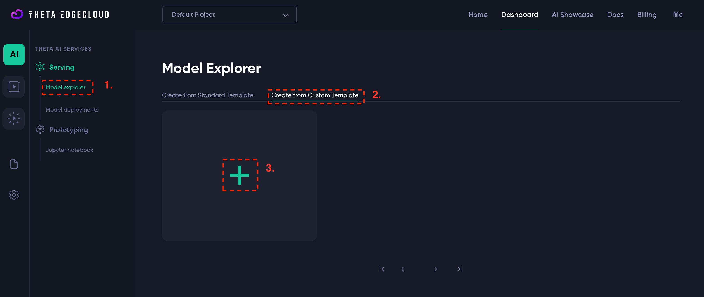
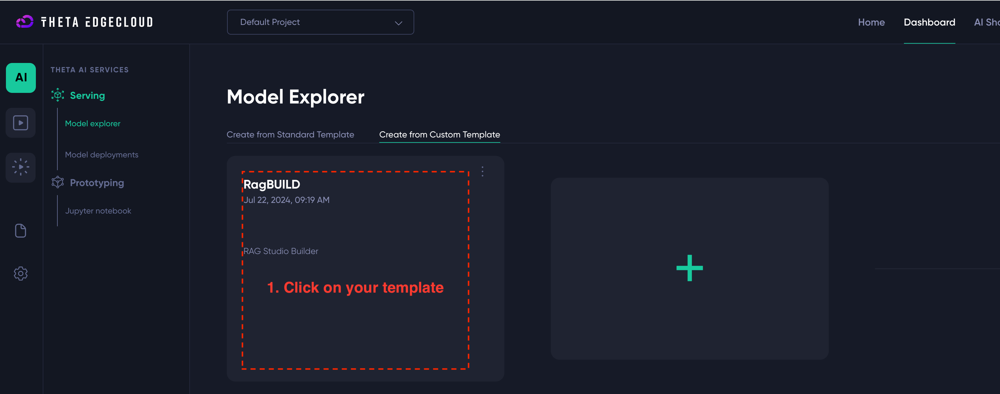
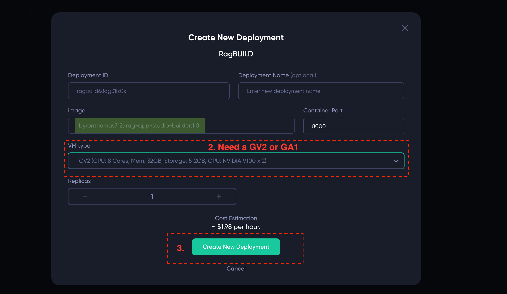
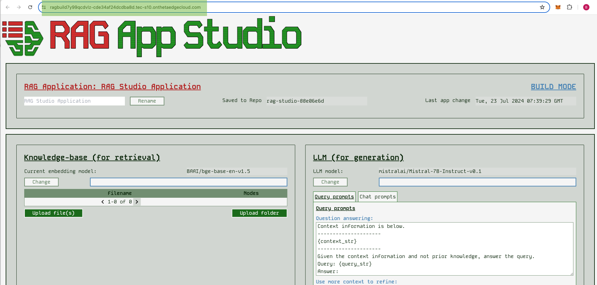
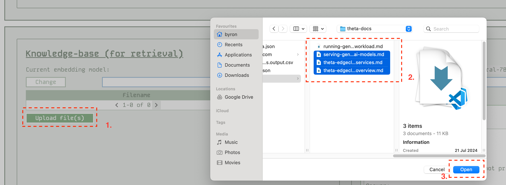
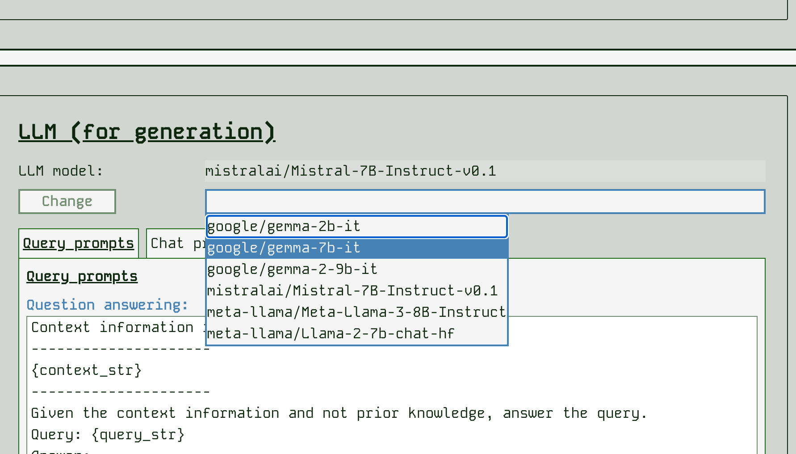
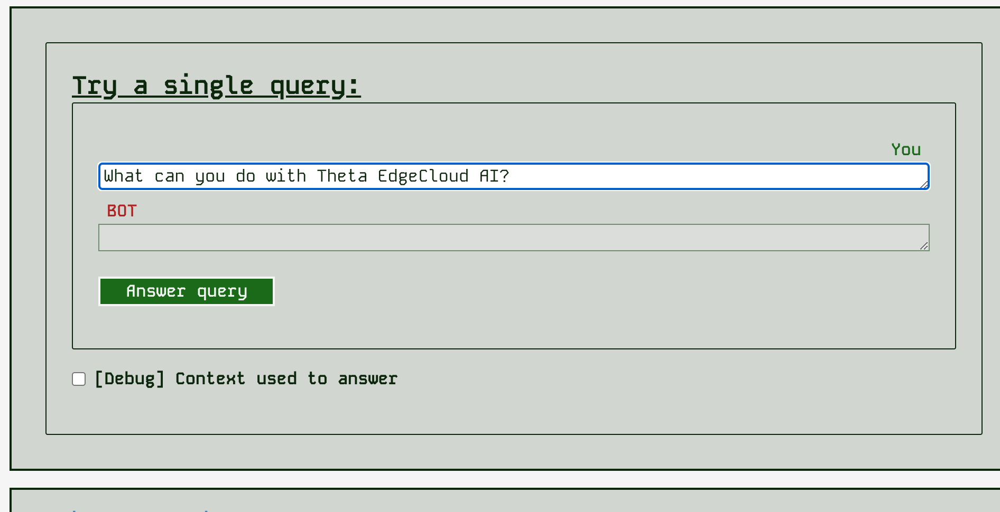
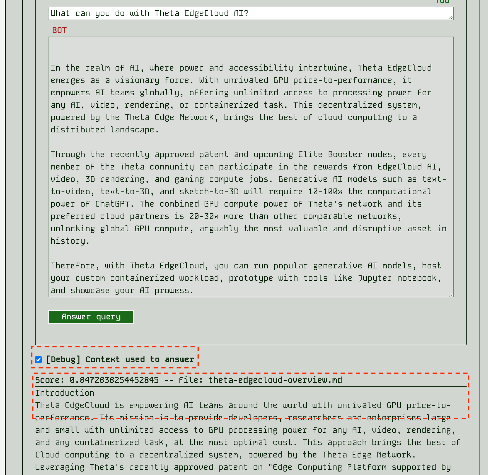
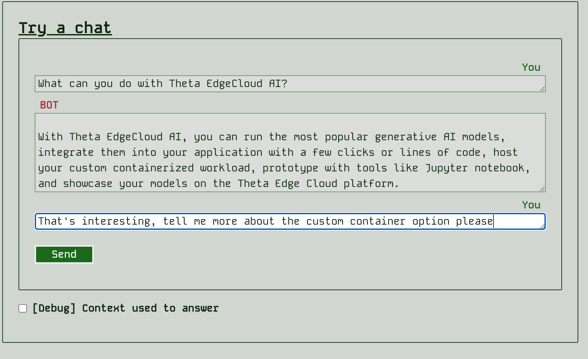

  

# Building your own document-enhanced AI chatbot

RAG stands for Retrieval-Augmented Generation. It allows you to specialise a Generative LLM like Mistral 7b with information it won't have seen in training, whether that's in-house knowledge that's not
available on the internet, or more recent information than it's been trained on. By focusing the LLM to answer queries using documents the application has, you can also focus it's attention more to the 
topics you want it to answer about, rather than treating every query as though some random part of its training data contains the query. This helps specialise it to your application, for example, if you
want to be a support helper, you can feed it with documentation about the things that are being supported.

In order to build a chatbot specialised with knowledge you control, you will normally:

1. Configure your knowledgebase
2. Set up a model and engineer your prompts
3. Profit

Building RAG-enhanced applications often takes a fair amount of experimentation and iteration, so you may need to [start from scratch sometimes](./detailed/multi-application-support.md#how-to-start-a-fresh-model) and build a new app based on what you've tried already and what you've learnt. You can find plenty of articles on using RAG and LLMs on sites like medium.com, here are a couple of starting points if you're interested:
* [A very detailed deep dive on a range of topics around how to build an app that uses LLMs](https://applied-llms.org/)
* [A write up on using RAG to make a searchable knowledgebase](https://towardsdatascience.com/how-i-turned-my-companys-docs-into-a-searchable-database-with-openai-4f2d34bd8736).

In RAG App Studio you will use the Builder app to experiment and configure your application, and then when it's ready for the general public, you will use the Runner app to interact with your application (which is more specialised to just handling chats and queries).

## Launching the builder app

The builder application is where you build your RAG application. The builder works in a single-application model, where you are only working on a single application in a single builder process, and if you happen to relaunch it you will pick up the same application again, but it does have the capability to support [developing multiple applications](./detailed/multi-application-support.md) by changing the way the builder is launched to specify which of your apps to work on.

In order to launch an instance of the builder, you need to create a template on Theta EdgeCloud to run a custom AI workload:

1. Navigate to the custom template page and click to add a template (see screenshot above)
2. Enter the following details for the template:
   1. Name - you can enter anything that helps you, I suggest `RAGBuild`
   2. Container Image URL - must be set to `byronthomas712/rag-app-studio-builder:1.0`
   3. Container Port - must be set to `8000`
   4. Environment variables - must be set to `{"HUGGING_FACE_HUB_TOKEN":"hf_SECRET"}` if your HuggingFace hub token is `hf_SECRET` - please be careful to enter this correctly or the app won't start
   5. You can set a description to help you identify it, I've used `RAG App Studio Builder`

Here is a screenshot showing how it would look if your token is `hf_SECRET` - **you must replace this value with your actual token!**

Once you have the builder template, you just need to create a new model deployment from it:

1. Click on your template name, e.g. `RAGBuild`
2. Select a big enough machine - you need at least GV2 or GA1
3. Click "Create New Deployment"

After clicking "Create New Deployment" you should see a new deployment like the below - you just need to wait until the Inference Endpoint link goes green (this will take a few minutes):

Once the "Inference Endpoint" link is green, you can click on it and you should be taken to a URL that ends in `onthetaedgecloud.com` and here you will see the Studio builder screen:

If you don't end up here, look for the "Endpoint" link by clicking on the model deployment and just copy paste that URL into your browser.

## Naming your app

Whilst not very important, naming your app can help you spot if you accidentally launch with a different app, and also show your users that they are interacting with what they expect. You can just enter a new name and click change to change the app name.
You can change this at any time.

## Configuring your knowledgebase

## The embedding model

**Before loading any documents** you should select your embedding model. **You cannot change this after uploading documents.**

An embedding model is an encoding that makes your documents searchable. They vary in model size and the languages they are intended to be used on. Changing the embedding can make the retrieval side of 
your application more effective, i.e. make the documents fed to the LLM more relevant to the query being asked.

You can change the embedding before uploading documents, by simply selecting a model name and clicking "Change" - be aware that changing a model requires clearing GPU memory, downloading a model and reloading into
the GPU which can take a minute or so. You will see the embedding name updated when it completes. 

RAG App Studio supports several embedding models. If you intend to only use english text, you will probably want to use `BAAI/bge-base-en-v1.5` or `BAAI/bge-large-en-v1.5` which are reasonably sized but
specialised to English. If you need multilingual support, the `BAAI/bge-m3` is multilingual as are the two models from `sentence-transformers`. You can look on their HuggingFace hub pages to find out more
details about each model.

[!Changing the embedding model](./images/embedding_model.png)

## Adding documents

Adding documents is fairly simple, you can either select one or more files, or a single folder to get them all uploaded. Be aware that each document will take some time, so you may want to go in smaller batches
just to see progress. Either that or dump a big batch and leave your screen on while you go get a coffee!

Once you have uploaded files, the app will show you what you have:

RAG App Studio currently supports the following file formats automatically: 
* .csv - comma-separated values
* .docx - Microsoft Word
* .epub - EPUB ebook format
* .hwp - Hangul Word Processor
* .ipynb - Jupyter Notebook
* .jpeg, .jpg - JPEG image
* .mbox - MBOX email archive
* .md - Markdown
* .pdf - Portable Document Format
* .png - Portable Network Graphics
* .ppt, .pptm, .pptx - Microsoft PowerPoint

## Configuring your LLM & prompts (Generation)

After setting up the Retrieval-Augmented part of your app, you can set up the Generation part! You will want to select the LLM to answer queries and chat with, and also carry out prompt engineering
to form queries & chats appropriately to get the answers you want in the style you want.

## Changing the LLM model

One of the most significant changes you can make is to change the LLM model. This can affect the class of GPU machine you need to run your app on, and will also likely massively affect the results.

In order to use a different LLM you need have access to it's HuggingFace hub repo - ensure you set this up as described [in the prerequisites](./pre-requisites.md).

RAG App Studio has a range of LLM models available - for more details of the models see their HuggingFace hub pages. Here we order them in increasing size / increasing machine requirements:
* google/gemma-2b-it - this is a very small model so can be run a more basic class of machine, however, in our initial tests it seems to perform significantly worse than other models at RAG (perhaps due to limited context size)
* google/gemma-7b-it - same number of parameters as Mistral 7B
* mistralai/Mistral-7B-Instruct-v0.1 - the default model, a good all-rounder
* meta-llama/Llama-2-7b-chat-hf
* meta-llama/Meta-Llama-3-8B-Instruct 

It is simple to change the model by selecting a different one and clicking "Change". Be aware that this will take several minutes as we need to clear GPU memory, download several GBs of data and load
those GBs of parameters into the GPU again. This is the slowest operation to wait for. You will see the model name update when it is complete.

## Prompt engineering

With the way that RAG App Studio works, there are several prompt templates that can be changed. It helps to think about what goes on in the background for a request.

For a single query:
1. The retrieval part of the app finds chunks of text from the knowledgebase that are similar in meaning to the query that has been submitted
2. The app forms a question to submit to the LLM by incorporating the most similar chunk of knowledgebase into an overall prompt for the LLM
3. The app then prompts the LLM again with any other chunks of knowledge returned in a form of "If you also knew x, would you change this answer you previously gave"

The prompt template for step 2 is shown in the app as the "Question answering" prompt. The prompt template for step 3 is shown in the app as the "Use more context to refine" prompt. You can edit these prompts
and submit to change how the app behaves. Be sure to [try a query](#try-a-query) after changing the prompts to see what difference it makes and whether you like the change.

[Example of changing the prompts for a single query interaction](./images/query_prompts)

The prompts that control a chat interaction are slightly different. When used as a chatbot, an app needs to go find relevant parts of the chat history using search against the query and then try to make
a single prompt for the LLM. For this reason we have a "Complete next chat" prompt that incorporates context, and a "Reframe a question using history" prompt template that can be edited:

[Example of changing the prompts for a chat interaction](./images/chat_prompts.png)

Be sure to [try a chat](#try-a-chat) after changing prompts to see the effect.

Things you might want to change in the prompts include:
* Instructing the LLM on how to answer - whether to include background knowledge for example
* Helping the LLM to understand how the contextual information might relate to the query, e.g. "A model deployment on ThetaEdge cloud is a docker-like container running in the cloud"
* Instructing the LLM on style - terseness / friendliness etc
* Instructing the LLM on what not to say, e.g. to improve chatbot safety by avoiding causing offence

Prompt engineering is a discipline it's own right, so there are a wealth of directions to go in!

## Trying out your app

### Try a query

You can try out a single query at any time by just entering it into the query box and hitting submit:

After you get the response, you can also show a panel that tells you about the retrieved context data - what the similarity score (0..1.0) was, what file the context came from and the text chunk found.

### Try a chat

You can also try a chat interaction at any time by using the "Try a chat" panel:

As with the query, you can debug what context the app retrieved for the last response.

## Details of the last save

In order to keep tabs on what's saved and where, you can look in the header area of the builder near the application name. 
You can see the HuggingFace hub repo that has been created privately for your user account and the last save point captured by the app:

## Checking the performance of retrieval

You can use the "Retrieval evaluation" page to have the LLM auto-measure how well the retrieval side of the app is performing. Currently we don't have any systematic metrics on the overall app evaluation.
In that page you can see the queries where the app seems to retrieve the best context or not (according to the LLM's judgement of what would be the best context).

## Next steps

[Run your application](./running.md)
