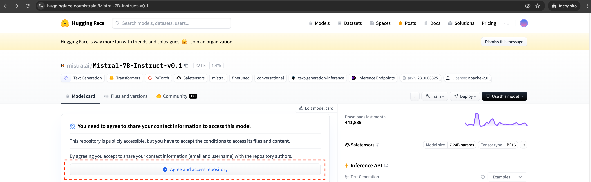

  

# Obtaining access to Mistral models on HuggingFace Hub

All of the powerful open-source models have gated access on HuggingFace Hub. The authors want to capture
basic contact details of anybody who uses their models so they can confirm they accept terms & conditions of
usage.

Because RAG App Studio uses Mistral 7B model by default, you have to have a user account on HuggingFace hub
that has access to this model (RAG App Studio logs in as the account that you provide it a HuggingFace hub token for). 
The below instructions provide an example to get access to this family of models,
to access other models that RAG App Studio supports, like Google's Gemma family, just find them in HuggingFace
and follow similar set of steps.

## Getting access

1. Log in to HuggingFace Hub
2. Navigate to the page for [mistralai/Mistral-7B-Instruct-v0.1 model](https://huggingface.co/mistralai/Mistral-7B-Instruct-v0.1)
3. Click to access the gated model (see screenshot)

