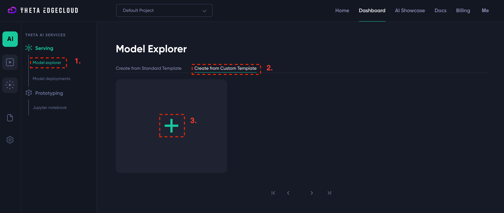
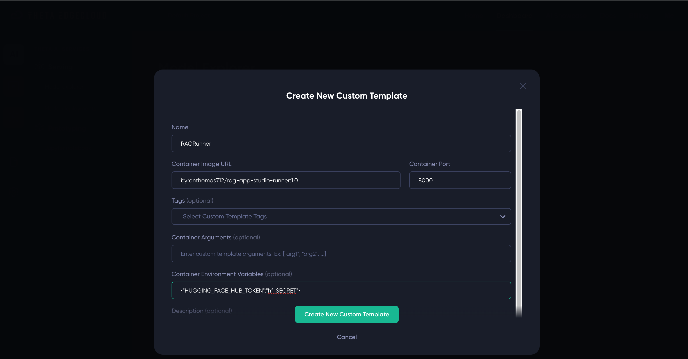

  

# RAG App Studio Runner

**IMPORTANT:** you cannot run the runner unless you have built an application using the builder - there is nothing to run.

The runner application is where you run your RAG application. The runner works in a single-application model, where you are only running a single application in a single runner process, and by default you will run whatever was the latest application you worked on. It does have the capability to support [running multiple applications](./detailed/multi-application-support.md) by changing the way the runner is launched to specify which of your apps to work on.

## Launching the runner

In order to launch an instance of the runner, you need to create a template on Theta EdgeCloud to run a custom AI workload:

1. Navigate to the custom template page and click to add a template (see screenshot above)
2. Enter the following details for the template:
   1. Name - you can enter anything that helps you, I suggest `RAGRunner`
   2. Container Image URL - must be set to `byronthomas712/rag-app-studio-runner:1.0` - **NOTE that this a different image to the builder template**
   3. Container Port - must be set to `8000`
   4. Environment variables - must be set to `{"HUGGING_FACE_HUB_TOKEN":"hf_SECRET"}` if your HuggingFace hub token is `hf_SECRET` - please be careful to enter this correctly or the app won't start
   5. You can set a description to help you identify it, I've used `RAG App Studio Runner`

Here is a screenshot showing how it would look if your token is `hf_SECRET` - **you must replace this value with your actual token!**

Once you have the builder template, you just need to create a new model deployment from it:

1. Click on your template name, e.g. `RAGRunner`
2. Select a big enough machine - you need at least GV2 or GA1
3. Click create

Then wait, within around 5 minutes the builder should be fully loaded.

**TODO TODO TODO - explain how to find the UI and what to do next**

## Interacting with your chatbot app

The example commands shown in ThetaEdge cloud UI for CURL, Python etc will work just fine with your deployed runner
instance - an app deployed with the RAG app studio runner supports the OpenAI API, so it can slot in with any
other LLM tooling you use easily.

However, if you prefer to just have a simple frontend for your users to chat with, then the runner app includes
that too. This frontend is described briefly below.

### Runner app frontend

At the top of the runner app UI, you should the details you expect telling you the app name, the repo it's being
served from, and the time of the last change:

In the runner app, you can perform either individual queries, or interact in a chatbot style. By default the chat
style is selected first, as this tends to be a more useful interaction style. The runner app also remembers your
previous chats with it, so you can return to an earlier chat and extend it if you wish. It remembers this on a
per-browser basis, unless you block cookies in which case it can't identify you so can't keep a history.

In the runner frontend, you can also change some of the inference settings passed to the model. Settings like
temperature affect how creative / random (high temperature) or fixed (low temperature) the LLM answers will be.
Refer to [OpenAI's API reference for more information on these settings](https://platform.openai.com/docs/api-reference/chat/create). As you can see below - changing these settings doesn't always lead to good outcomes!

You can also interact in a single-query style, with equivalent functionality to the builder app, except you can
change the inference settings.

At the bottom of the screen, you can also see the details of how the app was built (the content uploaded etc).
But these are readonly, since the runner is intended to be a deployment of the app, to change anything you need
to [use the builder app](./building.md).